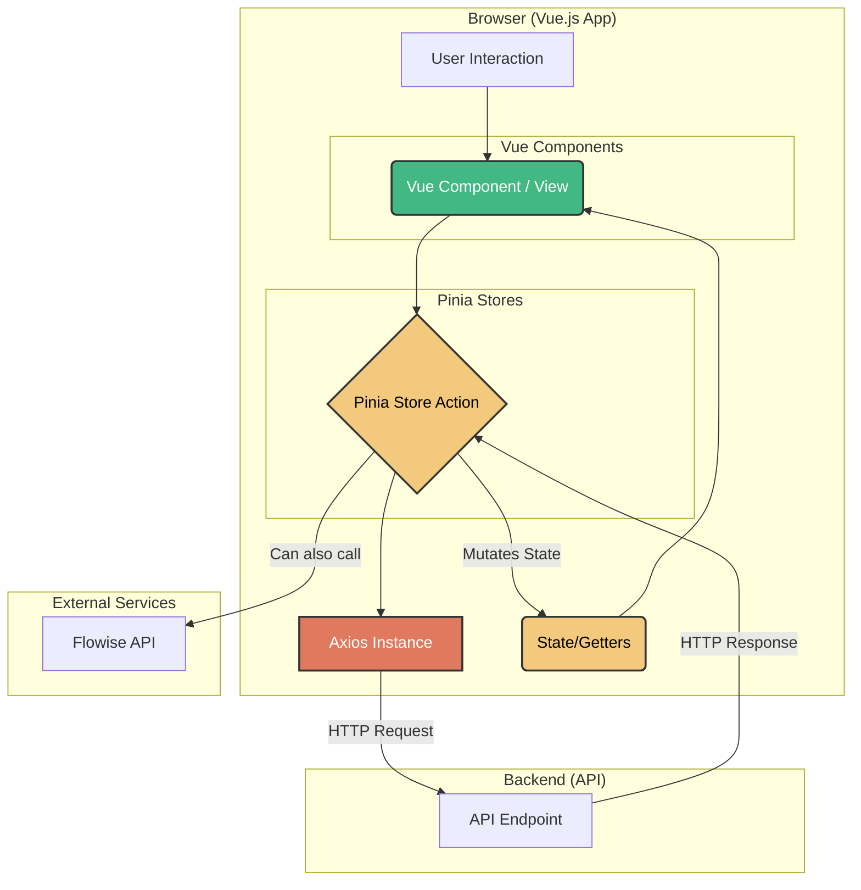

# Arquitectura del Frontend

La arquitectura del frontend de Martita IA está diseñada para ser modular, escalable y fácil de mantener. Se basa en patrones de diseño modernos del ecosistema de Vue.js, separando claramente las responsabilidades de la interfaz de usuario, la gestión de estado y la comunicación con servicios externos.

## Diagrama de Arquitectura

El siguiente diagrama ilustra los principales componentes de la arquitectura y cómo interactúan entre sí:

## Patrón de Diseño Principal

La aplicación sigue un **patrón de gestión de estado centralizado** combinado con una **arquitectura basada en componentes**.

1.  **Component-Based Architecture**: La interfaz de usuario está construida como un árbol de componentes de Vue. Esta división permite la reutilización, el encapsulamiento de la lógica y un desarrollo más organizado. La estructura distingue entre:
    *   **`layouts`**: Contenedores principales de la UI (ej. `DashboardLayout.vue`).
    *   **`views`**: Componentes de página completos asociados a una ruta específica (ej. `RulesView.vue`).
    *   **`components`**: Bloques de UI reutilizables y más pequeños (ej. `ConfirmationModal.vue`).

2.  **Centralized State Management**: Se utiliza **Pinia** como única fuente de verdad (`Single Source of Truth`) para el estado de la aplicación. Ningún componente modifica directamente el estado o realiza llamadas a la API por su cuenta. En su lugar, despachan acciones a los *stores* de Pinia, que son los únicos responsables de interactuar con el backend y mutar el estado.

## Flujo de Datos (Data Flow)

El flujo de datos es unidireccional y predecible, lo que facilita la depuración y el razonamiento sobre el estado de la aplicación.

1.  **Acción del Usuario**: Un usuario interactúa con un componente de la UI (ej. hace clic en "Guardar").
2.  **Despacho de Acción**: El componente no modifica datos directamente. En su lugar, invoca una acción del *store* de Pinia correspondiente (ej. `directionsStore.createDirection(data)`).
3.  **Lógica de Negocio (Store)**: La acción en el *store* de Pinia contiene la lógica. Realiza la llamada a la API a través del cliente Axios.
4.  **Mutación de Estado**: Una vez que la API responde, la acción del *store* confirma la mutación, actualizando el estado centralizado (ej. la lista `directions` en el *state*).
5.  **Reactividad**: Gracias a la reactividad de Vue, cualquier componente que esté utilizando ese estado (a través de `state` o `getters` de Pinia) se actualiza automáticamente para reflejar los nuevos datos.

## Gestión de Estado (Pinia)

La carpeta `src/stores/` contiene todos los módulos de estado de Pinia. Cada archivo representa un "slice" del estado global, agrupado por dominio de negocio.

-   **`auth.js`**: Gestiona la autenticación, el token JWT y la información del usuario logueado.
-   **`directions.js`**: Maneja el estado y las operaciones CRUD para las Direcciones.
-   **`procedures.js`**: Gestiona los Trámites.
-   **`rules.js`**: Administra las Reglas del Bot.
-   **`history.js`**: Almacena el historial de interacciones del chat.
-   **`flowise.js`**: Controla el estado de la comunicación con la API de Flowise (ej. para actualizar la memoria).
-   **`requisitos.js`, `pasos.js`, `formularios.js`**: Stores especializados para manejar las sub-entidades de un trámite, permitiendo una lógica de guardado más granular.

## Comunicación con la API (Axios)

La comunicación con el backend se centraliza en `src/boot/axios.js`. En este archivo:

1.  Se crea una **instancia de Axios** con la `baseURL` de la API, evitando la repetición de la URL en cada llamada.
2.  Se configura un **interceptor de peticiones**. Este interceptor se ejecuta antes de cada petición y su función es inyectar automáticamente el `Authorization: Bearer <token>` en las cabeceras si existe un token en el `authStore`. Esto desacopla la lógica de autenticación de las llamadas a la API en los *stores*.

## Enrutamiento (Vue Router)

El archivo `src/router/index.js` define la configuración de navegación de la aplicación.

-   **Rutas Públicas y Privadas**: Se definen rutas para visitantes (login, registro) y rutas protegidas que requieren autenticación.
-   **Layouts Anidados**: La ruta `/dashboard` utiliza el componente `DashboardLayout.vue` y anida las vistas de gestión (`rules`, `procedures`, etc.) como sus hijas. Esto permite que todas las vistas protegidas compartan la misma barra lateral y estructura principal.
-   **Navigation Guard**: Se utiliza `router.beforeEach` para implementar un guardia de navegación global. Este guardia comprueba si la ruta de destino requiere autenticación (a través de `meta: { requiresAuth: true }`) y si el usuario está autenticado (consultando el `authStore`). Si no lo está, lo redirige a la página de `/login`.

## Integración con Flowise

La integración con el chatbot de Flowise se gestiona en `src/services/martita-chatbot.js`.

-   **Inicialización**: La función `initChatbot` se importa y se llama en el componente raíz `App.vue` (`onMounted`), lo que asegura que el bot se cargue en toda la aplicación.
-   **Configuración**: Se leen variables de entorno (`VITE_FLOWISE_...`) para configurar el `chatflowid` y el `apiHost`.
-   **Captura de Historial**: Se utiliza la configuración `observersConfig` de Flowise para "escuchar" las conversaciones. Cuando un usuario recibe una respuesta del bot, se captura la pregunta y la respuesta, y se envía al endpoint `/interacciones/` del backend a través de una acción en el `historyStore`, persistiendo así la conversación.
