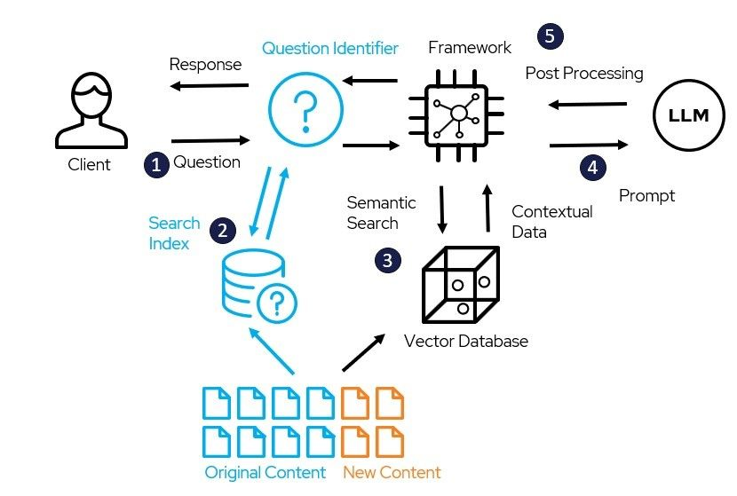
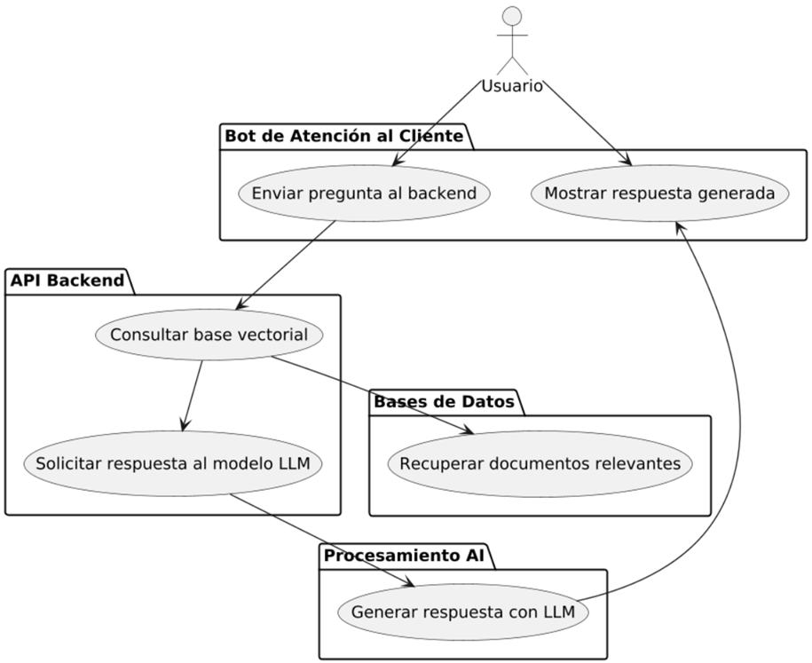
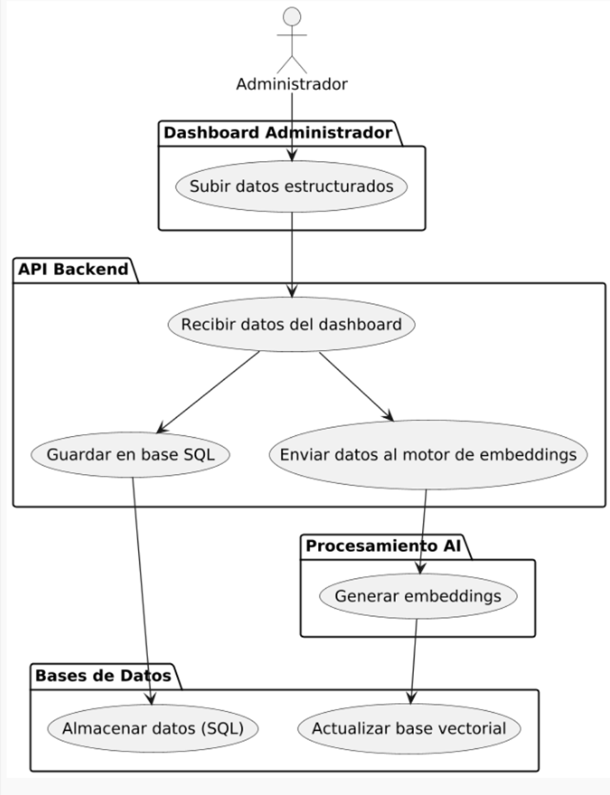

# Martita IA

  

## Presentación

"Martita IA" es un asistente virtual con inteligencia artificial, desarrollado como un proyecto de titulacion de Omar Sani Y Jean de la Cruz. Su propósito fundamental es servir como una guía interactiva y un orientador para los ciudadanos del cantón Cayambe en la realización de los trámites municipales a través del portal web del Gobierno Autónomo Descentralizado (GADIP). El sistema está concebido para mejorar la experiencia del usuario, optimizar la difusión de información y modernizar la gestión pública local.

<video width="100%" controls>
  <source src="/videos/mi_video.mp4" type="video/mp4" />
  Tu navegador no soporta el elemento video.
</video>

## Problemas que Resuelve

El desarrollo de "Martita IA" surge como una solución a las deficiencias identificadas en el portal web institucional del Municipio de Cayambe, entre las que se destacan:

* **Baja Usabilidad.** El proyecto responde a la falta de experiencia del ciudadano al acceder al portal web debido a su baja usabilidad.
* **Navegación Compleja:** Los trámites prioritarios se encuentran a múltiples niveles de profundidad (más de tres clics en promedio), lo que dificulta su localización por parte de los usuarios, especialmente aquellos con escasa experiencia digital.
* **Falta de Información Clara:** El sistema busca solucionar la falta de información explicativa sobre los procedimientos más comunes, obligando a los usuarios a acudir de forma presencial para resolver sus dudas.
* **Ineficiencia en la Atención Ciudadana:** El asistente pretende disminuir el volumen de atención presencial y reducir la carga operativa del personal municipal al canalizar y automatizar consultas frecuentes.

## Componentes Técnicos (Tecnologías sobre las que fue Desarrollado)

El sistema se construyó sobre un stack tecnológico moderno, seleccionado por su compatibilidad con la infraestructura existente y su rendimiento.

* **Frontend:**
  * **Lenguaje:** JavaScript
  * **Framework:** Vue.js
* **Backend:**
  * **Lenguaje:** Python
  * **Framework:** FastApi
* **Bases de Datos:**
  * **Relacional:** MySQL
  * **Vectorial:** FAISS (Facebook AI Similarity Search) dentro de flowise
* **Herramientas de IA y Despliegue:**
  * **Orquestador Visual:** Flowise-IA
  * **Ejecución de Modelos Locales:** Ollama
  * **Contenerización:** Docker
* **Documentacion:** Docusaurus

## Arquitectura del Sistema

La arquitectura de "Martita IA" es modular y se basa en el enfoque de **Generación Aumentada por Recuperación (RAG)**. Este diseño permite al sistema generar respuestas precisas y contextualizadas sin depender de conocimiento pre-entrenado, utilizando documentos institucionales como fuente de verdad.

### **Flujo de la Arquitectura RAG para Usuarios:**

  
1. El usuario envía una pregunta en lenguaje natural:
El proceso comienza cuando el usuario formula una pregunta en lenguaje natural, es decir, un texto que se entiende y se expresa de manera similar a cómo los humanos interactúan en conversaciones cotidianas.

2. El sistema convierte la pregunta en un vector y realiza una búsqueda semántica en la base de datos vectorial (FAISS):
El sistema toma la pregunta del usuario y la convierte en un vector mediante un modelo de procesamiento de lenguaje natural (NLP). Este vector representa semánticamente la pregunta, permitiendo que el sistema comprenda su significado en un espacio multidimensional. A continuación, realiza una búsqueda semántica en la base de datos vectorial, como FAISS, para recuperar los fragmentos de información más relevantes, basándose en la similitud de los vectores.

3. Los fragmentos recuperados forman un "contexto" que se une a la pregunta original:
Los fragmentos de información recuperados de la base de datos se utilizan como un "contexto" adicional. Este contexto contiene datos o información relevante relacionada con la pregunta. El sistema combina este contexto con la pregunta original para enriquecer la consulta y proporcionar una respuesta más precisa y relevante.

4. El conjunto (contexto + pregunta) se envía a un Modelo de Lenguaje Grande (LLM) que opera localmente, el cual genera una respuesta coherente y basada en la información proporcionada:
Una vez que la pregunta y el contexto han sido combinados, el conjunto se envía a un Modelo de Lenguaje Grande (LLM) que opera localmente. Este modelo, como GPT o similar, utiliza el contexto adicional para generar una respuesta coherente, precisa y alineada con la información relevante extraída de la base de datos, proporcionando así una respuesta que responde directamente a la consulta del usuario.

### **Flujo de la Arquitectura RAG para Administrador:**

 1. Inicio de sesión del administrador:
El administrador inicia sesión en el sistema a través de un proceso de autenticación, utilizando un token de autenticación, como JWT, para verificar su identidad y permisos. Este paso asegura que solo los usuarios autorizados tengan acceso al panel de control.

2. Acceso al panel de control de formularios:
Una vez autenticado, el administrador accede al panel de control donde puede gestionar los formularios. Desde este panel, el administrador puede crear, editar o eliminar formularios, así como consultar los datos ya almacenados.

3. Creación de un nuevo formulario:
El administrador crea un nuevo formulario a través de una interfaz de usuario (UI), donde se pueden definir diferentes tipos de campos (texto, selección múltiple, fechas, etc.). Al completar el formulario, los datos ingresados están listos para ser enviados a la base de datos.

4. Carga del formulario a la base de datos:
Los datos del formulario se envían mediante una API (como REST o GraphQL) hacia la base de datos. En este paso, la información se persiste en la base de datos (por ejemplo, PostgreSQL o MongoDB), donde se guarda de forma estructurada y accesible para futuras consultas.

5. Botón de "Actualizar memoria de bot":
Cuando el administrador desea actualizar la memoria de la IA (Martita), presiona el botón "Actualizar memoria de bot". Esta acción inicia un proceso en el backend que convierte los datos del formulario en representaciones vectoriales o embeddings mediante un modelo de procesamiento de lenguaje natural (NLP).

6. Generación de embeddings:
Los datos del formulario (como respuestas o textos ingresados) se procesan con un modelo NLP (por ejemplo, BERT o GPT) para generar embeddings. Estos embeddings son representaciones matemáticas en forma de vectores que capturan el significado y la estructura del texto original.

7. Almacenamiento de embeddings en FAISS:
Una vez generados los embeddings, estos se almacenan en FAISS (Facebook AI Similarity Search), una base de datos de vectores que permite realizar búsquedas rápidas y eficientes sobre grandes volúmenes de datos. FAISS es utilizado para gestionar la memoria de la IA, lo que le permite aprender de los datos previos y proporcionar respuestas contextuales basadas en los formularios previos.

* **Separación de Componentes:** El sistema está dividido en un backend desarrollado en FastAPI, un frontend en Vue.js y bases de datos relacionales y vectoriales que operan de manera desacoplada para facilitar el mantenimiento y la escalabilidad.

## Funcionalidades Principales

Las funcionalidades del sistema están diseñadas para dos tipos de actores: el ciudadano y el administrador del sistema.

* **Para el Ciudadano (Usuario Final):**
  * **Interacción mediante Lenguaje Natural:** Capacidad de formular preguntas sobre trámites de forma conversacional
  * **Asistencia Personalizada 24/7:** Obtener información sobre requisitos, pasos, horarios y enlaces relevantes de los trámites más frecuentes en cualquier momento
  * **Acceso Directo a la Información:** Reducir los tiempos de búsqueda y el número de clics necesarios para encontrar la información de un trámite en el portal web

* **Para el Administrador (Personal del GADIP):**
  * **Gestión de Trámites:** Cargar, actualizar y eliminar la información sobre los trámites municipales para mantener la base de conocimiento del bot al día
  * **Visualización de Interacciones:** Monitorear el historial de conversaciones para identificar preguntas frecuentes y oportunidades de mejora en la información
  * **Administración de Reglas del Bot:** Configurar los "prompts" o instrucciones que guían el comportamiento y el tono del asistente virtual