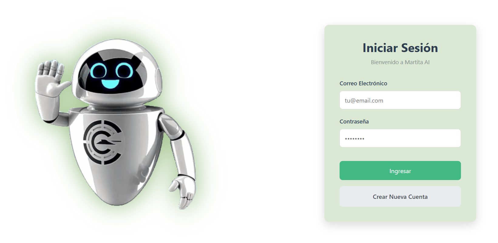

# Martita IA

 

## Presentación

"Martita IA" es un asistente virtual con inteligencia artificial, desarrollado como un proyecto de titulacion de Omar Sani Y Jean de la Cruz. Su propósito fundamental es servir como una guía interactiva y un orientador para los ciudadanos del cantón Cayambe en la realización de los trámites municipales a través del portal web del Gobierno Autónomo Descentralizado (GADIP). El sistema está concebido para mejorar la experiencia del usuario, optimizar la difusión de información y modernizar la gestión pública local.

  

## Video de Presentación

<video width="100%" height="100%" controls>
  <source src="/videos/mi_video.mp4" type="video/mp4" />
  Tu navegador no soporta el elemento video.
</video>

## Problemas que Resuelve

El desarrollo de "Martita IA" surge como una solución a las deficiencias identificadas en el portal web institucional del Municipio de Cayambe, entre las que se destacan:

* **Baja Usabilidad.** El proyecto responde a la falta de experiencia del ciudadano al acceder al portal web debido a su baja usabilidad.
* **Navegación Compleja:** Los trámites prioritarios se encuentran a múltiples niveles de profundidad (más de tres clics en promedio), lo que dificulta su localización por parte de los usuarios, especialmente aquellos con escasa experiencia digital.
* **Falta de Información Clara:** El sistema busca solucionar la falta de información explicativa sobre los procedimientos más comunes, obligando a los usuarios a acudir de forma presencial para resolver sus dudas.
* **Ineficiencia en la Atención Ciudadana:** El asistente pretende disminuir el volumen de atención presencial y reducir la carga operativa del personal municipal al canalizar y automatizar consultas frecuentes.

## 📌 Como Registrarse

En este video te mostramos paso a paso cómo registrarte en el sistema de Martita IA, una herramienta diseñada para facilitar la gestión de trámites y servicios en el Municipio de Cayambe. Aprenderás a crear tu cuenta de forma sencilla y rápida.

<video width="100%" height="100%" controls>
  <source src="/videos/mi_video.mp4" type="video/mp4" />
  Tu navegador no soporta el elemento video.
</video>

## 🏢 Video de Direcciones 

Aquí aprenderás cómo cargar y gestionar las direcciones o departamentos del Municipio de Cayambe en el sistema de Martita IA. Este proceso es fundamental para organizar la información institucional y mantener un control eficiente de las áreas administrativas.

<video width="100%" height="100%" controls>
  <source src="/videos/mi_video.mp4" type="video/mp4" />
  Tu navegador no soporta el elemento video.
</video>

## 📄 Video de Tramites

Este video te guiará en el proceso para cargar y administrar los trámites del Municipio de Cayambe. Descubrirás cómo ingresar correctamente la información relacionada con cada trámite, facilitando la atención y el seguimiento de los servicios ciudadanos.

<video width="100%" height="100%" controls>
  <source src="/videos/mi_video.mp4" type="video/mp4" />
  Tu navegador no soporta el elemento video.
</video>
